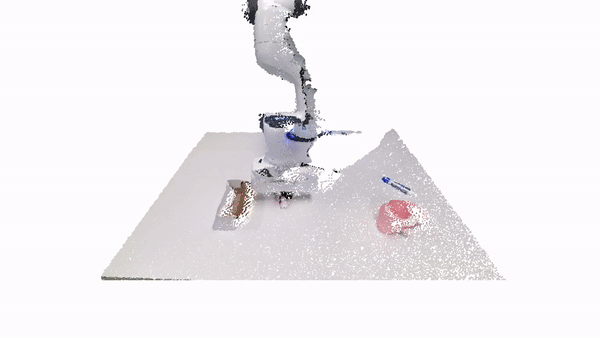

VIHE

[**VIHE: Transformer-Based 3D Object Manipulation Using Virtual In-Hand View**](https://vihe-3d.github.io/)  
[Weiyao Wang](https://wangweiyao.github.io/about-me/), [Yutian Lei](https://doublelei.me/), [Shiyu Jin](https://scholar.google.com/citations?user=GdYgso8AAAAJ&hl=en), [Gregory D. Hager](https://www.cs.jhu.edu/hager/), [Liangjun Zhang](https://www.cs.unc.edu/~zlj/) 

VIHE is a transformer-based imitation learning agent that leverages rendered virtual in-hand views for accruate 6-DoF action predictions.



## Getting Started
You can use [Install.sh](scripts/install.sh) directly to install the required dependencies. 
```bash
bash scripts/install.sh
```

Or you can follow the instructions below to install the dependencies manually.

### Install VIHE
- **Step 1 (Optional):**
We recommend using [conda](https://docs.conda.io/en/latest/miniconda.html) and creating a virtual environment.
```bash
conda create --name vihe python=3.8
conda activate vihe
```

- **Step 2:** Install PyTorch. Make sure the PyTorch version is compatible with the CUDA version. One recommended version compatible with CUDA 11.1 and PyTorch3D can be installed with the following command. More instructions to install PyTorch can be found [here](https://pytorch.org/).
```
conda install pytorch==1.12.1 torchvision==0.13.1 torchaudio==0.12.1 cudatoolkit=11.3 -c pytorch
```

- **Step 3:** Install PyTorch3D. One recommended version that is compatible with the rest of the library can be installed as follows. Note that this might take some time. For more instructions visit [here](https://github.com/facebookresearch/pytorch3d/blob/main/INSTALL.md).
```
conda install -c fvcore -c iopath -c conda-forge fvcore iopath
curl -LO https://github.com/NVIDIA/cub/archive/1.10.0.tar.gz
tar xzf 1.10.0.tar.gz -C VIHE/lib/ && rm 1.10.0.tar.gz
export CUB_HOME=$(pwd)/VIHE/lib/cub-1.10.0

conda install jupyter
pip install scikit-image matplotlib imageio plotly opencv-python

pip install black usort flake8 flake8-bugbear flake8-comprehensions
FORCE_CUDA=1 pip install 'git+https://github.com/facebookresearch/pytorch3d.git@stable'
```

- **Step 4:** Install CoppeliaSim. PyRep requires version **4.1** of CoppeliaSim. Download and unzip CoppeliaSim: 
- [Ubuntu 16.04](https://www.coppeliarobotics.com/files/CoppeliaSim_Edu_V4_1_0_Ubuntu16_04.tar.xz)
- [Ubuntu 18.04](https://www.coppeliarobotics.com/files/CoppeliaSim_Edu_V4_1_0_Ubuntu18_04.tar.xz)
- [Ubuntu 20.04](https://www.coppeliarobotics.com/files/CoppeliaSim_Edu_V4_1_0_Ubuntu20_04.tar.xz)

Once you have downloaded CoppeliaSim, add the following to your *~/.bashrc* file. (__NOTE__: the 'EDIT ME' in the first line)

```
export COPPELIASIM_ROOT=<EDIT ME>/PATH/TO/COPPELIASIM/INSTALL/DIR
export LD_LIBRARY_PATH=$LD_LIBRARY_PATH:$COPPELIASIM_ROOT
export QT_QPA_PLATFORM_PLUGIN_PATH=$COPPELIASIM_ROOT
export DISLAY=:1.0
```
Remember to source your .bashrc (`source ~/.bashrc`) or  .zshrc (`source ~/.zshrc`) after this.

- **Step 5:** Clone the repository with the submodules using the following command.

```
git clone --recurse-submodules https://github.com/doublelei/VIHE.git && cd VIHE && git submodule update --init
```

Now, locally install RVT and other libraries using the following command. Make sure you are in folder RVT.
```
pip install -e .
pip install -e VIHE/lib/PyRep 
pip install -e VIHE/lib/RLbench 
pip install -e VIHE/lib/YARR 
``` 
 
- **Step 6:** Download dataset.
    - For experiments on RLBench, we use [pre-generated dataset](https://drive.google.com/drive/folders/0B2LlLwoO3nfZfkFqMEhXWkxBdjJNNndGYl9uUDQwS1pfNkNHSzFDNGwzd1NnTmlpZXR1bVE?resourcekey=0-jRw5RaXEYRLe2W6aNrNFEQ) provided by [PerAct](https://github.com/peract/peract#download). Please download and place them under `RVT/rvt/data/xxx` where `xxx` is either `train`, `test`, or `val`.  

    - Additionally, we use the same dataloader as PerAct, which is based on [YARR](https://github.com/stepjam/YARR). YARR creates a replay buffer on the fly which can increase the startup time. We provide an option to directly load the replay buffer from the disk. We recommend using the pre-generated replay buffer (98 GB) as it reduces the startup time. You can either download [replay.tar.xz](https://drive.google.com/file/d/1wOkLk8ymsp3TCFWOPOQLZZJ4OIZXRUjw/view?usp=drive_link) which contains the replay buffer for all tasks or replay buffer for [indidual tasks](https://drive.google.com/drive/folders/1n_vBXEL2lWmJTNxwQIuI_NinAGGhby5m?usp=drive_link). After downloading, uncompress the replay buffer(s) (for example using the command `tar -xf replay.tar.xz`) and place it under `RVT/rvt/replay/replay_xxx` where `xxx` is either `train` or `val`. Note that is useful only if you want to train RVT from scratch and not needed if you want to evaluate the pre-trained model.


## Usage

```bash
$ python generate_data.py 
```

```bash
$ python train.py agent=<agent>
```

```bash
$ python eval.py agent=<agent> agent.model_path=<model_path>
```


